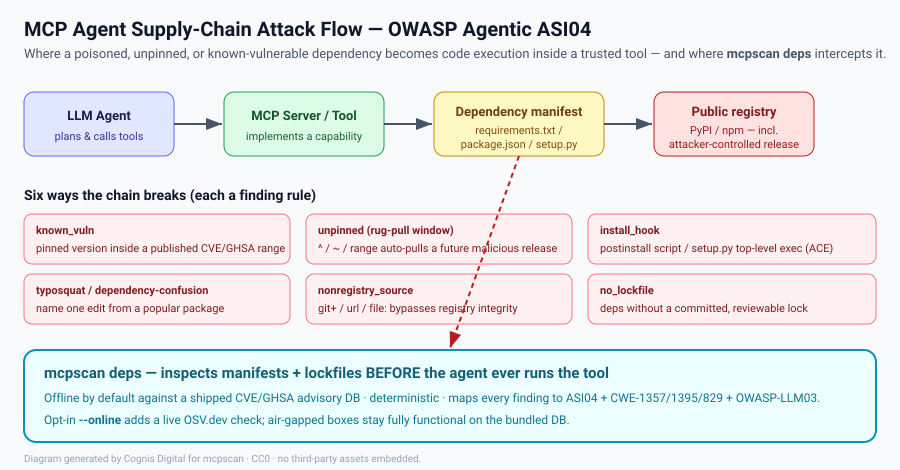

# Supply-chain / dependency audit — `mcpscan deps`

> OWASP Top 10 for Agentic Applications (2026) — **ASI04 Agent Supply Chain**
> CWE-1357 (uncontrolled component) · CWE-1395 (vulnerable dependency) ·
> CWE-829 (inclusion from an untrusted control sphere) · OWASP-LLM03.



*Diagram: Cognis Digital, CC0 — generated SVG, no third-party assets embedded.*

## Why this matters (the frank, technical version)

An MCP server is a bag of *tools* an LLM is told it may call. The model trusts
those tools implicitly — that is the whole point of the protocol. But a tool is
just code, and code has dependencies. The trust the model places in
`run_query` or `fetch_url` silently extends to **every package those tools
import**, and to every transitive dependency under those, and to the registry
that served them.

That is the soft underbelly. You can write a perfectly hardened MCP server —
no `eval`, no `shell=True`, taint-clean, schema-validated — and still hand an
attacker code execution *inside* it because:

- A maintainer of a transitive dependency turned malicious (the **rug-pull**):
  the version you "depend on" is `^4.0.0`, and `4.1.0` ships a credential
  stealer. Your lockfile-less `npm install` picks it up on the next CI run.
- You pinned a version that has a **published, exploitable CVE** — e.g.
  `jinja2==2.4.1` carries CVE-2019-10906 (sandbox escape) and CVE-2025-27516
  (attr-filter sandbox breakout). An agent that renders attacker-influenced
  templates through that Jinja is now an RCE primitive.
- A dependency runs **arbitrary code at install time** — a `postinstall`
  script in `package.json`, or a `setup.py` that does `os.system(...)` at
  module top level. The payload runs on `npm install` / `pip install`, before
  any human reviews a single line, on the build box that has your secrets.
- The dependency name is a **typosquat** — `loadash`, `reqests`,
  `python-dateutils` — or an internal name that an attacker also published to
  the public index (**dependency confusion**), so the wrong package resolves.
- The dependency is pulled from a **non-registry source** (`git+https://…`,
  a tarball URL, a `file:` path) that bypasses registry integrity entirely and
  can be swapped without a version bump.

None of these are exotic. Every one of them has burned real production agents.
ASI04 exists in the 2026 taxonomy precisely because the agent supply chain is
now an attack surface in its own right, distinct from the agent's own code.

## What `mcpscan deps` does

It parses the dependency manifests your MCP server ships and reports concrete,
defensible supply-chain risk. It does **not** install anything, run any of the
code, or contact the network unless you explicitly ask (`--online`).

| Rule | Severity | What it catches |
|------|----------|-----------------|
| `supplychain.known_vuln` | matches the advisory | a **pinned** version that falls inside a published CVE/GHSA/OSV range |
| `supplychain.unpinned` | low | a floating/range spec (`^`, `~`, `>=`, `*`, bare name) — the rug-pull window |
| `supplychain.no_lockfile` | low | a manifest with deps but no committed lockfile (`package-lock.json` / `poetry.lock` / `uv.lock` / pinned constraints) |
| `supplychain.install_hook` | high | npm `pre/post-install` scripts, or a `setup.py` that executes code at module top level |
| `supplychain.typosquat` | medium | a dependency name one edit-distance from a widely-used package but not that package |
| `supplychain.nonregistry_source` | medium | a dependency from a VCS/URL/local source |

Supported manifests: `requirements.txt`, `requirements.in`, `pyproject.toml`
(PEP 621 `[project]` + Poetry), `setup.py`, `package.json`.

Every finding is mapped to **ASI04**, a CWE, and OWASP-LLM03, so it travels
into the same table / JSON / SARIF / HTML / badge outputs as the rest of
mcpscan and shows up in code-scanning dashboards alongside the static findings.

## Offline-first, deterministic by default

The advisory database (`mcpscan/data/advisories.json`) and the popular-package
allowlist (`mcpscan/data/popular_packages.json`) ship **inside the wheel**.
They contain only real, documented advisories (copied by id/summary from
OSV.dev / the GitHub Advisory Database) and real package names.

```bash
mcpscan deps ./my-mcp-server            # offline, deterministic, air-gap-safe
```

Run it on a disconnected build box, on military/edge gear, in a hermetic CI
sandbox — the result is byte-for-byte identical every time. There is **no**
network call on this path; the test suite enforces that (a monkeypatched
`urlopen` that raises if touched).

When you *want* fresh data, opt in:

```bash
mcpscan deps ./my-mcp-server --online   # also query OSV.dev live per pinned dep
```

The live OSV.dev lookup augments the offline DB; if the network is unavailable
the scan degrades gracefully to the bundled advisories and keeps working. You
can also point at a curated DB you control:

```bash
mcpscan deps ./my-mcp-server --advisory-db ./our-internal-advisories.json
```

## A real walkthrough

Suppose an MCP server ships this `requirements.txt`:

```
jinja2==2.4.1
requests>=2.0
flask
reqests==2.31.0
mypackage @ git+https://github.com/some-fork/mypackage.git
```

```bash
$ mcpscan deps ./server --fail-on high
mcpscan — dependency audit: ./server
manifests scanned: 1
======================================================================
[HIGH] supplychain.known_vuln   {CWE-1395, OWASP LLM03, ASI04, MS:agent-supply-chain}
        'jinja2==2.4.1' is affected by GHSA-462w-v97r-4m45 (CVE-2019-10906):
        Jinja2 sandbox escape via str.format / format string
        at:  ./server/requirements.txt:1
        fix: Upgrade past the fixed version; if pinned for reproducibility,
             track the advisory and patch on the next review cycle.
[HIGH] supplychain.known_vuln   {CWE-1395, OWASP LLM03, ASI04, MS:agent-supply-chain}
        'jinja2==2.4.1' is affected by GHSA-cpwx-vrp4-4pq7 (CVE-2025-27516): ...
[MED ] supplychain.nonregistry_source  {CWE-829, OWASP LLM03, ASI04, ...}
        Dependency 'mypackage' is pulled from a non-registry source (git+https://…)
[MED ] supplychain.typosquat    {CWE-1357, OWASP LLM03, ASI04, ...}
        Dependency 'reqests' is one edit away from popular package(s) requests …
[LOW ] supplychain.no_lockfile  {CWE-1357, OWASP LLM03, ASI04, ...}
[LOW ] supplychain.unpinned     {CWE-1357, OWASP LLM03, ASI04, ...}  flask, requests
----------------------------------------------------------------------
score=0/100  critical=0 high=2 medium=2 low=3 info=0
```

`--fail-on high` makes the process exit non-zero, so this gates a CI pipeline:
the build fails because of `jinja2==2.4.1`, the engineer upgrades to
`jinja2==3.1.6`, re-runs, and the audit goes green.

## How the matching works (so you can trust it)

- **Version ranges** use OSV semantics: a version is *affected* when
  `introduced <= v < fixed` (or `<= last_affected`, or open-ended when no fix
  is published). Comparison is a PEP-440/semver numeric tuple with zero-padding,
  so `2.11` and `2.11.0` compare equal and pre-release tags don't hide a match.
- **Unpinned specs are never matched against the CVE DB** — they have no
  concrete version. They're reported separately as `unpinned`, because the risk
  there is *future* drift, not a *current* known vulnerability.
- **Ecosystem isolation**: a PyPI `ws` is never matched against an npm `ws`
  advisory and vice-versa.
- **Typosquatting** is a *heuristic*, edit-distance ≤ 1 against a curated
  allowlist of popular names. It surfaces a candidate for human review; it
  never auto-blocks and never claims certainty.

## Boundaries

This is **defensive, authorized-use tooling**. It reads manifests and reports
risk. It does not exploit anything, does not fabricate advisories (every entry
in the shipped DB is a real, documented CVE/GHSA you can look up), and the
typosquat list is real package names only. Use it on code you own or are
authorized to assess.
